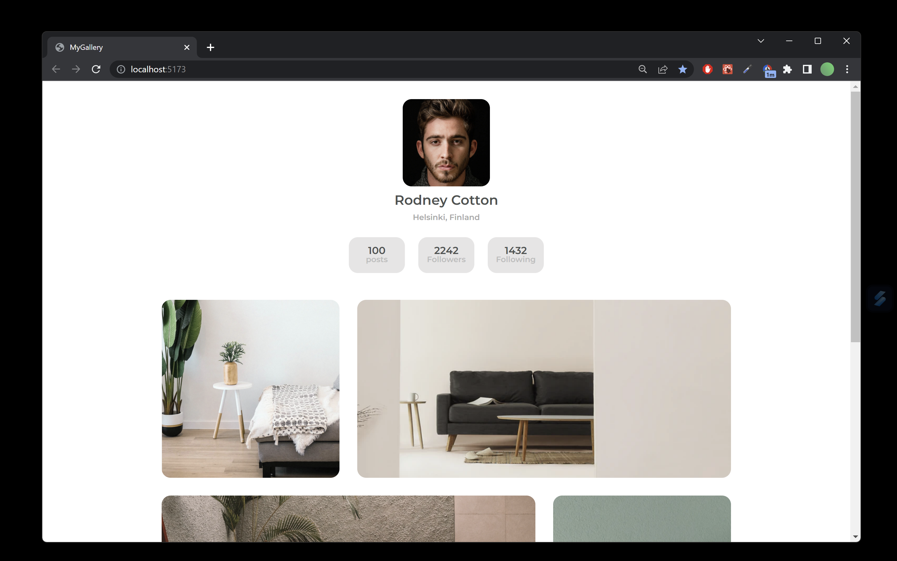

# Profile Gallery Page

This project is a small React.js application that implements a profile gallery page similar to Instagram's. It showcases a user's profile image, full name and location, posts, followers and following numbers, and a photo gallery.



The application was built using the Vite.js build tool and uses only React.js and vanilla CSS.

## Installation

To install and run the application, first clone the repository:

```
git clone https://github.com/GuidoCarda/profile-galery.git
cd profile-gallery
```

Then, install the dependencies using npm:

```
npm install
```

Finally, start the development server:

```
npm run dev
```

This will start the development server on `http://localhost:3000`, where you can view the application in your browser.

## Usage

Once the development server is running, you can navigate to `http://localhost:3000` to view the profile gallery page. The page will display the user's profile image, full name and location, posts, followers and following numbers, and a photo gallery.

## Contributing

If you would like to contribute to this project, feel free to submit a pull request. Please make sure to follow the project's code style and guidelines.
